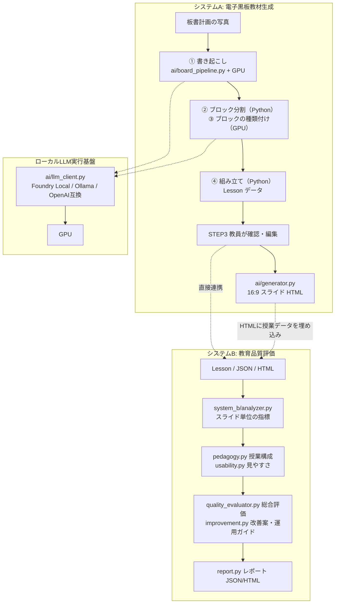

# AI電子黒板教材生成 & 教育品質評価システム (ai_e_board)

教員の**板書計画の写真**を GPU で動くローカル AI が読み取り、授業の構成（目標・導入・定義・例題・練習・まとめ）を保った **16:9 の電子黒板教材**を作る**システムA**と、教材の授業構成・電子黒板としての見やすさ・情報量を評価して改善案と授業運用ガイドを示す**システムB**からなる、教育工学の研究用システムです。

AI は教員を置き換えず、解析結果は必ず教員が確認・修正してから教材になります（Human-in-the-Loop）。

---

## 1. 研究背景と目的

- **研究テーマ**: 教員が作成した板書計画を基に AI が電子黒板教材を自動生成し、教育品質を評価・改善する支援システムの開発
- **発展テーマ**: AI システムを活用した電子黒板の効果的運用と教育の質向上
- **設計方針**
  - 板書に書かれた問題・途中式・答えは AI に書き換えさせない（板書上の誤りもそのまま残し、STEP3 で教員が確認する）
  - 読み取れなかった項目は「要確認」として示し、推測で埋めない
  - 解析はすべて**ローカル**（GPU）で行い、板書画像を外部に送らない

---

## 2. システム構成



### 板書解析の流れ（`ai/board_pipeline.py`）
1. **書き起こし（画像・GPU）**: 板書を列ごと・1行ずつ見たとおりに書き起こす（`prompts/transcribe_board.txt`）
2. **ブロック分割（Python）**: 列の変わり目、「例5」「練習11」「(2)」などの番号、「〜という。」の定義文、めあての囲みで区切る。小問には親の番号を付ける（例: 練12 (2)）
3. **種類付け（テキスト・GPU）**: AI はブロックごとの種類（導入・定義・公式・例題・練習）と見出し・ヒント・指導のポイント、授業全体のタイトル・目標・導入・まとめ・指導メモだけを書く（`prompts/structure_board.txt`）。板書に無い番号や、ブロックの形と矛盾する種類は採用しない
4. **組み立て（Python）**: 問題文・途中式・答えを書き起こしの原文から取り出して Lesson を作る

AI 解析に失敗したときはエラーと AI の生出力を表示し、デモ用授業に黙って差し替えることはありません（デモは明示的なボタンでのみ使用し、研究ログに `is_mock: true` と記録）。

---

## 3. セットアップ（どのPCでも共通の手順）

Python 3.11 以上が必要です。

### ① Python 環境
```bash
python -m venv .venv
.venv\Scripts\activate          # Windows
source .venv/bin/activate       # macOS / Linux
pip install -r requirements.txt
```

### ② GPU で動くローカル LLM の準備
画像解析は **GPU での実行が必須**です（GPU 以外で動いている場合はエラーになります。開発時のみ `LLM_ALLOW_CPU=1` で許可）。
実行環境は `ai/llm_client.py` が自動で選びます: **Foundry Local → Ollama → OpenAI互換サーバー**。

**推奨: Microsoft Foundry Local**（Windows / macOS。Microsoft 署名済みのため Windows のスマート アプリ コントロール有効時も動作）

```bash
winget install Microsoft.FoundryLocal                            # Windows
brew tap microsoft/foundrylocal && brew install foundrylocal    # macOS

python tools/setup_llm.py      # 診断 → モデル取得（約4GB）→ 互換パッチ → GPU動作テスト
python tools/setup_llm.py --check     # 診断のみ（何も変更しない）
python tools/setup_llm.py --restore   # 互換パッチを元に戻す
```

`tools/setup_llm.py` は PC の GPU を表示し、Foundry Local がその PC で **GPU 版のモデルを選ぶか**を確認してから、Qwen3.5 のモデルファイルに次の互換パッチを当てます（`ai/model_patches.py`。ファイルの中身の形で判定し、何度実行しても同じ結果。原本は `.orig` に保存）。
- `embedding.onnx`: 画像トークンのマスクを bool のまま Expand する処理が、一部の GPU（Qualcomm Adreno など）の WebGPU でシェーダー生成に失敗する。数学的に等価な行単位の ScatterND に書き換える
- `chat_template.jinja`: 4B 版のテンプレートが既定で推論（thinking）を始めるため、2B 版と同じ「既定で推論しない」に揃える

#### PC ごとの注意
| PC | 想定する実行環境 | 状態 |
|---|---|---|
| Windows・Snapdragon X（Adreno GPU） | Foundry Local（WebGPU） | **動作確認済み**。1枚あたり約2.5〜3分 |
| Windows・Intel Core Ultra（Arc GPU） | Foundry Local（Intel 向け GPU 版を自動選択） | 未確認。`setup_llm.py` で判定 |
| Windows・NVIDIA / AMD GPU | Foundry Local、または Ollama | 未確認 |
| Mac（Apple Silicon） | Foundry Local（Metal）、または Ollama | 未確認。`setup_llm.py` で判定 |
| Linux | Ollama（NVIDIA / AMD）または OpenAI互換サーバー | 未確認 |

- Windows ARM64 版の Ollama は GPU を使えません（CPU 実行になるため、この環境では Foundry Local を使ってください）。
- 別の PC に移したら、最初に `python tools/setup_llm.py` → `python tools/eval_boards.py` を実行し、GPU 動作と解析品質を確認してください。

**代替: Ollama**（NVIDIA / AMD / Apple Silicon の GPU）
```bash
ollama pull qwen3-vl:4b-instruct       # 推論しない instruct 版を使う
# 起動時に環境変数 LLM_BACKEND=ollama を指定
```

**代替: OpenAI互換サーバー**（LM Studio / llama-server など）: `LLM_BACKEND=openai`、`OPENAI_COMPAT_BASE_URL`、`OPENAI_COMPAT_MODEL`、`OPENAI_COMPAT_DEVICE=gpu` を指定。

#### 主な環境変数
| 変数 | 既定値 | 説明 |
|---|---|---|
| `LLM_BACKEND` | `auto` | `auto` / `foundry` / `ollama` / `openai` |
| `FOUNDRY_VISION_MODEL` | `qwen3.5-4b` | Foundry Local のモデル（`qwen3.5-2b` は速いが精度が下がる） |
| `LLM_IMAGE_MAX_SIDE` | `1280` | 画像の長辺（下げると文字の細かい板書で読み取りが崩れる） |
| `LLM_REQUIRE_GPU` / `LLM_ALLOW_CPU` | `1` / `0` | GPU 実行の必須化 / 開発時の CPU 許可 |
| `LLM_TIMEOUT_SECONDS` | `600` | 1回の生成のタイムアウト |
| `OLLAMA_ALLOWED_HOSTS` | `localhost,127.0.0.1,::1` | 接続を許可するホスト（SSRF 対策） |

### ③ アプリの起動
```bash
streamlit run app.py
```

### ④ 使い方
- サイドバーで「AI実行環境」と GPU 動作（🟢 GPU で実行）を確認します。
- **システムA**: STEP1 写真のアップロード → STEP2 AI解析（① 書き起こし → ② 構成の整理）→ STEP3 確認・編集（「要確認」の項目が冒頭に一覧表示されます）→ STEP4 生成 → STEP5 表示
- STEP5 の「この教材の教育品質を評価・改善する」で**システムB**へ引き継げます。システムB単独でも、システムAが出力した JSON / HTML をアップロードして評価できます。

---

## 4. システムBの評価の仕組み

同じ授業は、Lesson・JSON・HTML のどの経路で入力しても**同じ点数**になります（システムAの HTML には授業データが埋め込まれており、スライドは常に同じ生成処理で作ってから評価します）。

| カテゴリ（重み） | 算出方法 |
|---|---|
| 授業構成（35%） | 目標15・導入15・解説15・例題20・練習20・まとめ15 の合計（下限なし） |
| 目標の整合性（25%） | 目標なし 40 / あり 75（単元・タイトルに対応していれば +10、2項目以上で +5） |
| 電子黒板の見やすさ（25%） | 情報量の多いスライド数・スライド枚数から算出 |
| 情報量のバランス（15%） | 情報量が過多（Dense）のスライド数から算出 |

- スライドの情報量: Low / Moderate / High / Dense（文字数と数式数の**両方**が範囲内のときだけ下の段階）
- 学習指導要領: `data/curriculum/`（高校数学の一部）と単元名・トピック名で照合（例: 「順列」→ 数学A「場合の数と確率」）。単元名が未確定なら照合しません
- 良い点・注意点・総評は評価結果から組み立てます。LLM による定性フィードバック（任意）は文章だけを補強し、点数は変えません

---

## 5. 品質評価ツールとテスト

```bash
python tools/eval_boards.py                    # data/eval/boards.json の板書を GPU で解析して採点
python tools/eval_boards.py --only quadratic
python tools/eval_boards.py --from-raw outputs/eval/<実行日時>   # 保存済み出力を組み立て直して再採点（GPU不要）
```
採点: 板書に書かれた式・語句の再現率（content）、授業構成の充足（structure）、板書に無い内容の混入（forbidden）。合格ライン content ≥ 0.85・structure ≥ 0.85。

| 板書 | content | structure | 所要時間（Snapdragon X / Adreno X1-45） |
|---|---|---|---|
| `uploads/IMG_0938.jpeg`（平方完成） | 1.00 | 1.00 | 約150秒 |
| `uploads/IMG_0939.png`（順列） | 0.96 | 1.00 | 約170秒 |

```bash
python -m pytest tests/ -q
```
- AI を呼ばない単体テスト（LLM は偽のバックエンドに置き換え）と、Streamlit の画面操作テスト（`tests/test_app_flow.py`）を含みます。
- 生成物・ログはテストごとの一時フォルダに書き込まれ、`outputs/` を汚しません（`tests/conftest.py`）。
- `tests/fixtures/` は実際の GPU 書き起こし結果です。

---

## 6. ディレクトリ構成

```
ai_e_board/
├── app.py                  Streamlit アプリ（システムA/B）
├── config.py               設定（LLM実行環境・パス・環境変数）
├── ai/
│   ├── llm_client.py       ローカルLLM実行基盤（Foundry Local / Ollama / OpenAI互換、GPU必須判定）
│   ├── model_patches.py    Qwen3.5 モデルファイルの互換パッチ
│   ├── board_pipeline.py   板書解析（書き起こし → ブロック分割 → 種類付け → 組み立て）
│   ├── board_markup.py     数式表記の正規化などの補助
│   ├── vision.py           画像解析の窓口（VisionAnalyzer）
│   ├── generator.py        16:9 スライド HTML の生成（授業データを埋め込み）
│   ├── security.py         アップロード保存先・接続先ホストの検証
│   ├── evaluator.py        システムA側の簡易チェック
│   └── parser.py           （旧）JSON 解析。現在の解析処理では未使用
├── system_b/               システムB（analyzer / pedagogy / usability / curriculum / quality_evaluator / improvement / report / pipeline）
├── models/                 データモデル（schemas.py / evaluation_schemas.py / samples.py = デモ用授業）
├── ui/                     画面部品（board.py / evaluation.py / styles.css）
├── prompts/                transcribe_board.txt / structure_board.txt / evaluate_quality.txt（他は旧版・未使用）
├── tools/                  setup_llm.py（LLM準備）/ eval_boards.py（品質評価）
├── data/                   curriculum/（学習指導要領データ）/ eval/boards.json（評価用の正解）
├── tests/                  自動テスト・fixtures
├── uploads/                アップロード画像（セッションごとのフォルダ、ランダムなファイル名）
└── outputs/                生成教材・評価レポート・研究ログ・eval 結果
```

---

## 7. トラブルシューティング
| 症状 | 対処 |
|---|---|
| サイドバーが「🔴 AI実行環境に接続できません」 | `python tools/setup_llm.py --check` で診断。Foundry Local が未インストールならインストール |
| 「GPUでの実行が必須です」エラー | その PC で GPU 版が選ばれていません。GPU ドライバの更新、または Ollama（GPU 対応 PC）を使用 |
| `Failed to create a WebGPU compute pipeline ... Expand` | 互換パッチが未適用です。`python tools/setup_llm.py` を実行（Foundry のモデル更新後も再実行） |
| `[Device] is lost`（GPU デバイス喪失） | 自動で Foundry Local を再起動して1回やり直します。繰り返す場合は PC を再起動 |
| 解析結果に推論の文章や繰り返しが混ざる | テンプレートのパッチが未適用の可能性。`setup_llm.py --check` で `template=already` を確認 |
| llama.cpp / anyllm-kit が起動しない（Windows） | スマート アプリ コントロールが未署名の実行ファイルをブロックしています。Foundry Local を使ってください |
